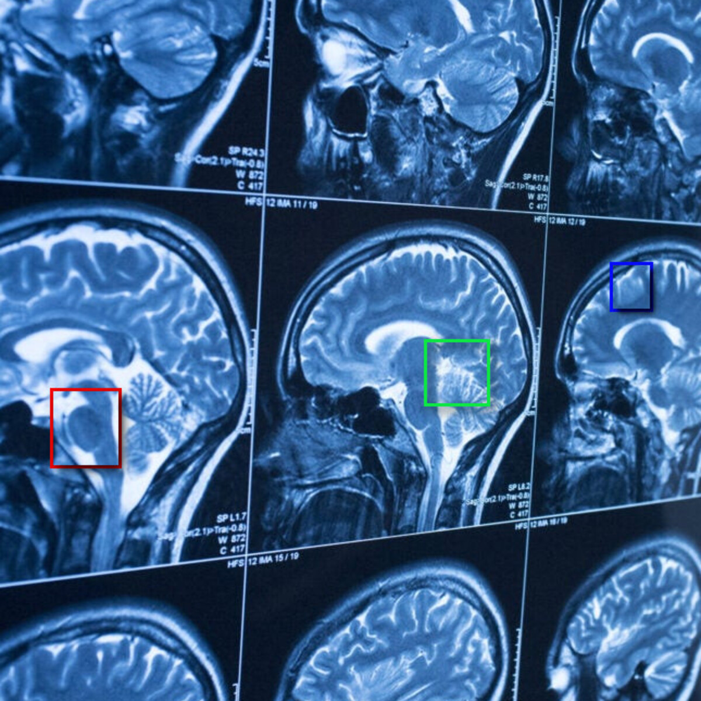

# Brain-Tumor-Classification-from-MRI-images-TL-

A brain tumor multiclass classification from MRI images using transfer learning technique. 
Two models' performance is compared:
  1) TL on top of VGG16 <- (36M params)
  2) TL on top of EfficientNetB0 <- (4.5M params)
Still further improvements must be done:
1) Additional regularization techniques must be applied to decrease overfitting
2) Object Detection and Segmentation must be provided for a better overall usage
